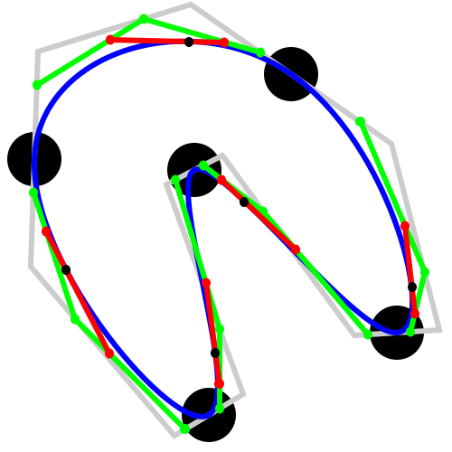

\[grab and drag the pads\]  
<embed src="scripted-svg-840x472.svg" type="image/svg+xml" width="840" height="472">

# scripted-svg

Javascript animated SVG graphics

### Welcome to the Wonderful World of embedded javascript

Example of embedded javascript in a `SVG` image. Coding `SVG` is like coding `HTML` canvas.

Note that the script is only executed if the `SVG` is viewed directly in a javascript enabled player (browser) or embedded in `HTML` with the `<embed>` element.

The inspiration to create this was to add sandboxed javascript to github/gitlab/gitea `README.md` files.
However, only after creation it turns out that it does not work with `` elements and `README.md` does not allow `<embed>`.

Parked here for historics and inspirations.

## Demonstration

The SVG is interactive. You can drag the black pads to change the curve.

You need to host the `SVG` image on GitHub-pages.
Using the repository version (`raw.githubusercontent.com`) will not work as GitHub sends the `HTTP` header `"Content-Security-Policy: default-src 'none'; style-src 'unsafe-inline'; sandbox"` which disables the javascript.

Standard `README.md` links do not open in a new window and `` images miss resizing abilities.

Some suggested ways of using a `SVG` image (size is 500x500):

### Inline image (with javascript disabled) wrapped in whatever you pleases


```html
        
```


### Inline image (with javascript enabled) wrapped in whatever you pleases

```html
        <embed src="https://xyzzy.github.io/scripted-svg/scripted-svg-500x500.svg" type="image/svg+xml">
```

<embed src="https://xyzzy.github.io/scripted-svg/scripted-svg-500x500.svg" type="image/svg+xml" width="200" height="200">

NOTE: Will only work in `HTML` as `README.md` removes `<embed>` tags, Otherwise: `SVG` is interactive, you can move the black pads to change the curve.

NOTE: Browsers have a broken implementation as they do not scale mouse coordinates.


### Wrap the `SVG` with HTML to apply styling


```html
        <a href="https://xyzzy.github.io/scripted-svg/scripted-svg-500x500.svg" target="_blank"></a>
```

<a href="https://xyzzy.github.io/scripted-svg/scripted-svg.html" target="_blank"></a>

NOTE: The `SVG` when opened will full-screen.

## Source code

Grab one of the tarballs at [https://github.com/xyzzy/scripted-svg/releases](https://github.com/xyzzy/scripted-svg/releases) or checkout the latest code:

```sh
        git clone https://github.com/xyzzy/scripted-svg.git
```

## Versioning

Using [SemVer](http://semver.org/) for versioning. For the versions available, see the [tags on this repository](https://github.com/xyzzy/scripted-svg/tags).

## License

Everything withing `<script>` and `</script>` is part of `ccbc` and is licensed under the GNU Affero General Public License v3 - see the [LICENSE.txt](LICENSE.txt) file for details.
Everything else (the important stuff) is MIT.

## Acknowledgments

* W3C for their amazing work on SMIL and the browsers implementing it.
* Originating project [https://github.com/RockingShip/ccbc](https://github.com/RockingShip/ccbc)
